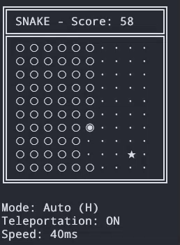
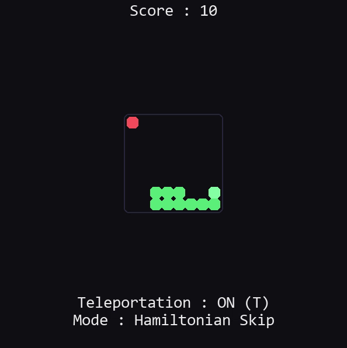

# Snake Game

A Python implementation of the classic Snake game with multiple viewing modes and AI strategies.

## Features

- Multiple rendering modes: Console and Pygame
- Configurable game settings (grid size, speed, colors)
- Multiple AI strategies: Player-controlled, Dummy, Cycle, Hamiltonian, Hamiltonian Skip
- YAML-based configuration system

## Screenshots

### Console View



### Pygame View



## Requirements

- Python >= 3.13
- PyYAML >= 6.0.3
- Pygame >= 2.6.1

## Installation

Install dependencies using uv:

```bash
uv sync
```

Or using pip:

```bash
pip install pyyaml pygame
```

## Usage

Run the game with the default configuration:

```bash
cd project
python run.py
```

Run with a specific configuration:

```bash
python run.py --config console
python run.py --config console_player
python run.py --config hamiltonian_skip
python run.py -c default
```

## Configuration

Configuration files are located in the `config/` directory:

- `default.yaml` - Pygame view with player controls
- `console.yaml` - Console view with cycle strategy
- `console_player.yaml` - Console view with player controls
- `hamiltonian_skip.yaml` - Hamiltonian Skip strategy (optimized path-finding)

### Configuration Options

- `game.grid_width` / `game.grid_height` - Grid dimensions
- `game.wrap_around` - Enable/disable edge wrapping
- `game.properties.initial_speed` - Starting game speed (milliseconds)
- `game.strategy` - AI strategy (player, dummy, cycle, hamiltonian, hamiltonian_skip)
  - `player` - Manual control via keyboard
  - `dummy` - Random movements
  - `cycle` - Simple hamiltonian cycle
  - `hamiltonian` - Complete hamiltonian cycle path
  - `hamiltonian_skip` - Optimized hamiltonian cycle with shortcuts
- `graphics.enable` - Enable/disable Pygame graphics

## Controls

When using player strategy:

- Arrow keys or ZASD - Move the snake
- ESC - Quit the game

## AI Strategies

### Player Strategy
Manual control of the snake via keyboard inputs.

### Dummy Strategy
Random movement selection for testing.

### Cycle Strategy (Hamiltonian)
Follows a pre-calculated Hamiltonian cycle that covers all cells in the grid. This guarantees the snake will never collide with itself, but can be slow as it visits every cell.

### Hamiltonian Skip Strategy
An optimized version of the Hamiltonian cycle strategy that takes shortcuts when safe to do so. The snake tries to reach the food faster while maintaining safety by:
- Following the Hamiltonian cycle as a fallback
- Taking shortcuts when there's enough space between the head and tail
- Dynamically adjusting behavior based on snake length
- Supporting random cycle generation for varied patterns

This strategy provides a better gameplay than the cycle strategy while being faster.

## Project Structure

```
project/
├── config/          # Configuration files
├── src/
│   ├── app.py       # Main application
│   ├── controller/  # Game controllers and input handlers
│   ├── model/       # Game state and snake logic
│   ├── strategies/  # AI strategies
│   └── view/        # Rendering (console and pygame)
└── run.py           # Entry point
```

## License

This project is provided as-is for educational purposes.

